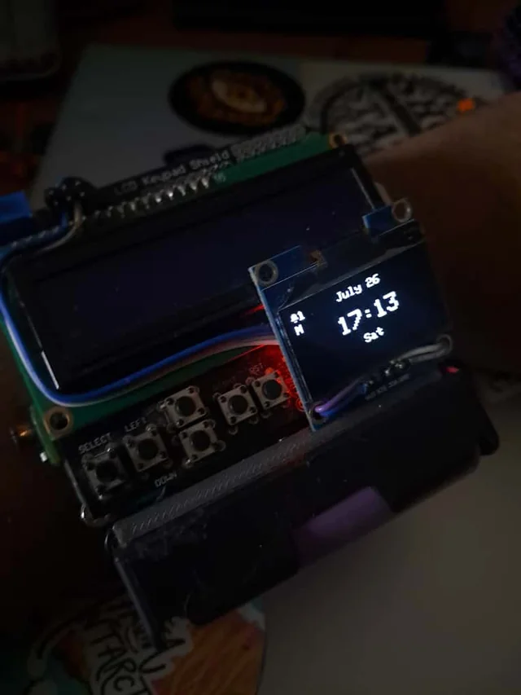

# FitBoyMk2

---
## Device Image



---

## Description

FitBoyMk2 is a smartwatch built using an ESP32 microcontroller. The device can connect to your smartphone via Bluetooth to display notifications, control music playback, and show health data. Click on the pics directory to see more pictures!

---

## Features

* **Time:** Duh
* **Notification Viewer:** Displays notifications from your connected smartphone.
* **Focus Mode:** Uses the secondary LCD to display information from an App regardless of if the app is currently active.
* **Health Viewer:** Shows heartrate and estimates calories burnt.
* **Music Viewer:** Displays currently playing music information from your connected phone and provides playback control.
* **Dual Display:** Uses both an OLED and an LCD screen for displaying information.

---

## Hardware Components

* **Microcontroller:** ESP32
* **Displays:**
    * SH110X OLED Display
    * TC1602 LCD Display (The one I used is mounted on a shield and came with buttons attached)
* **Input:** 
    * Buttons for user interaction (connected to pin 12 and others defined in `buttons.h`)
    * SON1303 Heart rate PPG sensor
    * MPU 6050 for step detection
* **Hardware Connectivity**
    * The MPU6050 and the OLED both use the I2C bus to connect to the ESP32. 
    * The LCD uses a 4 bit parallel connection.
    * The buttons are each connected to a voltage divider thus providing an analog signal, which is decoded to determine which button is currently pressed.
    * THE SON1303 provides a digital signal which is used to calculate the heart rate.

---

## Getting Started

### Installation

1.  **Clone the repository:**
    ```
    git clone https://github.com/DS-Aditya-928/FitBoyMk2.git
    ```
2.  **Open the project in Arduino IDE:**
    Open the `FitBoyMk2.ino` file in the Arduino IDE.
3.  **Install libraries:**
    Make sure you have all the necessary libraries installed. You can find the list of included libraries in the `includes.h` file.
4.  **Upload the code:**
    Select the correct board and port for your ESP32 and upload the sketch.

---

## Code Overview

The main file is `FitBoyMk2.ino`, which initializes the app manager and sets up the displays. The AppManager initializes the BTManager. The core logic is modularized into different files:

* `App.h`: Defines the base class for all applications.
* `MainMenu.h`, `NotViewer.h`, `FocusMode.h`, `HealthViewer.h`, `musicViewer.h`: These files contain the specific logic for each application.
* `BTManager.h`: Handles Bluetooth connectivity and callbacks. Provides the BTInstance class for Apps to communicate over bluetooth.
* `LCDHandler.h`: This file manages the LCD, including a priority-based writing system and backlight control.
* `DS_OLED.h`: This file extends the `Adafruit_SH1106G` library to provide a custom function for scrolling text on the OLED display.
* `buttons.h`: Handles button inputs.
* `includes.h`: Includes all the necessary header files and libraries.
* `globalVars.h`: Contains global variables used across the project. Mostly unused, should remove.
* `bitmaps.h`: Stores bitmaps for icons and images.